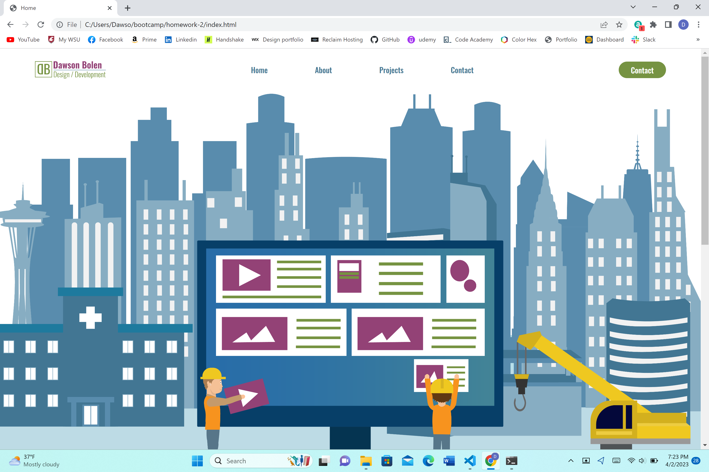

# Homework-2

## Description
This is a portfolio website for me to use as a place to put my projects and work. I added a homepage that had a large graphic of a city scape with a computer in the front to represent web development. I created this myself in adobe Illustrator along with all of my other graphics and images. I have an extensive background in graphic design. I then created an about me page that talked about my background and some of my skills. I then added a projects page with various projects displayed. Lastly, I created a contacts page with info on how to reach me. Disclaimer: the form doesn't actually work. I don't know how to do that yet, I just added it to show that I plan to include something like that at some point.

View the live application right from [Here](https://dawsonbolen.github.io/Homework-2/)
View the repo [Here](https://github.com/DawsonBolen/Homework-2)

## Installation
NA

## Usage
This will be used by me to continue adding to my portfolio as well as future employers who may be interested in hiring me

## Credits
NA

## License 
MIT